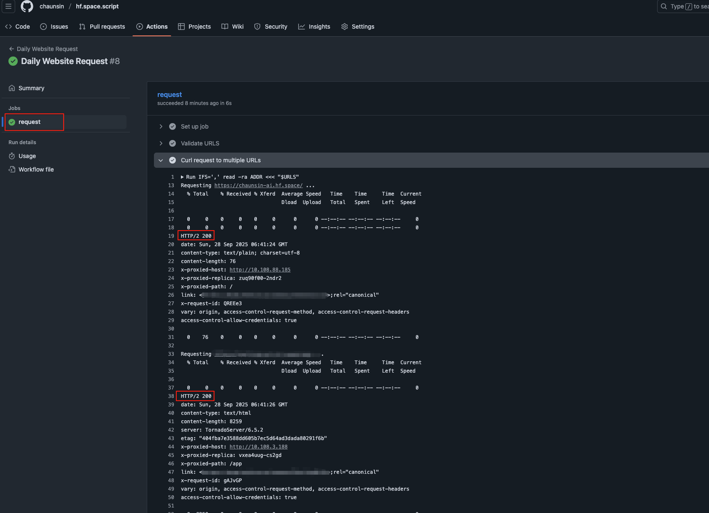

# 🚀 hf.space.script

通过 GitHub Actions 定时自动访问 **hf.space**，保证服务活性。

详情查看 👉 [Set a custom sleep time](https://huggingface.co/docs/hub/spaces-gpus#sleep-time)

## ⚠️ 声明

本项目仅供学习与参考，请勿用于非法用途！如遇封号、数据丢失等情况，概不负责！！！

## 1️⃣ Fork 本仓库

点击 **Fork** 按钮到自己的仓库：  

## 2️⃣ 设置环境变量

找到并进入自己的hf.space.script仓库，操作流程步骤:

**Settings -> Actions -> Variables -> New repository variable**

### `URLS`

服务地址列表：

- **必填**: ✅
- **Name**: `URLS`
- **Value**: `https://<你的账户名>-<项目名称>.hf.space/`

👉 如果有多个访问地址，用英文逗号 `,` 隔开，切记不要使用中文符号。

访问时间：

定时任务默认请求访问时间默认值为 **UTC 02:00**，即北京时间 **10:00:00**
每天执行一次。如要修改可在 [cornjob.yml](.github/workflows/cornjob.yml)中修改 `on.schedule.cron`值

📌 Crontab 表达式编写工具: [crontab.guru](https://crontab.guru/)

## 🔍 查看运行结果

路径：**Actions -> All workflows**

选择其中一个任务：

判断结果：

- **HTTP 状态码 200** = 请求成功 ✅
- **非 200** = 检查以下情况：
    1. 配置的访问地址是否正确
    2. hf.space 服务是否正常
    3. 访问地址是否支持 `GET` 请求（如不支持，请修改 [cornjob.yml](.github/workflows/cornjob.yml) 中的 `curl` 方法）

默认情况下每天执行一次，如果想临时运行，可以点击 **Run workflow** 按钮手动触发任务。

## ❓ 常见问题

**1. 为什么我的任务没有在预定时间执行？**  
GitHub Actions 的 `schedule` 在高负载时可能会延迟，尤其是每小时的开始时刻。

👉 为了保证任务稳定执行，建议把时间设置提前。

更多参考：

- [GitHub 官方文档](https://docs.github.com/zh/actions/reference/workflows-and-actions/events-that-trigger-workflows#schedule)
- [为什么 GitHub Actions 的定时任务不工作？](https://upptime.js.org/blog/2021/01/22/github-actions-schedule-not-working/)  
